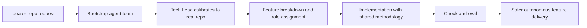

<div align="center">

# StackMoss

**Turn vague AI coding requests into a calibrated agent team that can actually ship.**

StackMoss bootstraps runtime-native agent teams for **Claude Code**, **Cursor**, **VS Code / Copilot**, **Codex**, and **Antigravity** from one deterministic source of truth.

[](https://www.npmjs.com/package/stackmoss)
[](LICENSE)
[]()
[](package.json)

</div>

Most AI coding setups stop at "here are some rules."

StackMoss goes further: it generates a **working team model** with roles, governance, methodology, calibration flow, and eval scaffolding so your agents can plan, implement, review, and verify work with much less drift.

## What StackMoss Gives You

After bootstrap, your repo is no longer just "prompted". It gets a team that can:

- turn rough product intent into a Tech Lead-first delivery flow
- break work into **15 specialized role lanes** — from TL, BA, DEV through FE, BE, FS, MOBILE, DEVOPS, DATA, PE, and UIUX
- enforce working discipline via **7 methodology modules**: planning, TDD, debugging, evidence, review, Git workflow, and execution loop
- recalibrate to the real repo instead of blindly following a template
- run sanity checks and portable evals before you trust the team on real feature work

## What Your Agents Actually Do

Without StackMoss, vibe coding usually looks like this:

- ask for a feature
- agent guesses scope
- implementation drifts
- testing is inconsistent
- docs and prompts become stale

With StackMoss, the repo gets a structured operating loop:



That means your agents can move through a more realistic sequence:

1. Understand the product direction and repo context.
2. Lock or confirm scope before writing code.
3. Plan the work in bounded, verifiable steps.
4. Execute with role-specific behavior instead of one giant generic prompt.
5. Verify through checks and eval instead of claiming success too early.

## Built for Vibe Coding, But With Guardrails

StackMoss is useful when you want fast AI-assisted building without the usual chaos.

It keeps the speed of vibe coding, but adds:

- a clear Tech Lead-first workflow
- replace-only config updates
- explicit user confirmation before shared config patches
- runtime-native outputs instead of one-size-fits-all prompt blobs
- an eval loop so you can test team behavior, not just hope for it

## Agent Roles

StackMoss ships **15 roles** organized into core team and specialized lanes:

| Role | ID | Capabilities |
|:---|:---|:---|
| Tech Lead | `TL` | Architecture, code review, context maintenance, planning |
| Business Analyst | `BA` | Requirements elicitation, acceptance criteria |
| Developer | `DEV` | Implementation, environment knowledge, debugging |
| Quality Assurance | `QA` | Test verification, regression checklists |
| Documentation | `DOCS` | README updates, changelog |
| Security-lite | `SEC` | Basic security checks |
| DevOps-lite | `OPS` | Deploy and infra checks |
| **Frontend** | `FE` | UI components, CSS/theming, accessibility |
| **Backend** | `BE` | API endpoints, database schema, authentication |
| **Fullstack** | `FS` | API-to-UI integration, scaffolding, performance |
| **Mobile** | `MOBILE` | Native UI, bundle/memory/battery, sensors/permissions |
| **DevOps Engineer** | `DEVOPS` | CI/CD, Docker/K8s/cloud, logging/alerting |
| **Data Engineer** | `DATA` | ETL pipelines, data modeling, data quality |
| **Prompt Engineer** | `PE` | System prompts, eval harness, chain orchestration |
| **UI/UX Designer** | `UIUX` | Design tokens, prototyping, usability reviews |

Roles are **auto-selected** based on a 2D matrix of persona (BizLed, DevLed, Solo, Newbie) × project type (MVP, Production, InternalTool, LibraryAPI). Production teams get specialized FE+BE, MVP teams get FS.

## Methodology Modules

| Module | Scope | What it enforces |
|:---|:---|:---|
| TDD Cycle | DEV, QA | Red → Green → Refactor discipline |
| Debugging Protocol | DEV | Systematic error diagnosis |
| Evidence Gate | ALL | Claims require proof |
| Planning Protocol | TL | Parallel-friendly task clusters |
| Review Reception | ALL | Accept feedback gracefully |
| **Git Workflow** | ALL | Conventional commits, push before context loss |
| **Execution Loop** | ALL | TL assigns → DEV builds → QA audits → Ship/Block |

## Runtime Targets

| Target | Output |
|:---|:---|
| Claude Code | `CLAUDE.md` + `.claude/skills/<skill>/SKILL.md` |
| Cursor | `.cursor/skills/<skill>/SKILL.md` |
| VS Code / Copilot | `.github/copilot-instructions.md` |
| Codex | `AGENTS.md` + `.agents/skills/<skill>/SKILL.md` |
| Antigravity | `.agent/{skills,rules,workflows}` |

## Quick Start

Install:

```bash
npm install -g stackmoss
```

Use in an existing repo:

```bash
cd /path/to/repo
stackmoss init
```

Or create a fresh workspace:

```bash
stackmoss new my-project
cd my-project
```

Then:

1. answer the intake
2. open your runtime and start with Tech Lead
3. run `stackmoss check`
4. run `stackmoss eval smoke`

Full walkthrough: [QUICK_START.md](QUICK_START.md)

## What Gets Generated

```text
my-project/
|-- team.md
|-- FEATURES.md
|-- NORTH_STAR.md
|-- NON_GOALS.md
|-- README_AGENT_TEAM.md
|-- AGENTS.md
|-- CLAUDE.md
|-- .agents/
|-- .claude/
|-- .cursor/
|-- .agent/
|-- .github/
|-- stackmoss.config.json
`-- evals/
```

## Command Reference

| Command | Description |
|:---|:---|
| `stackmoss new <name>` | Create a new StackMoss workspace |
| `stackmoss init [name]` | Bootstrap StackMoss in the current repo |
| `stackmoss inject` | Scan an existing repo and sync migration facts |
| `stackmoss resolve` | Resolve migration questions |
| `stackmoss promote --confirm` | Move from `MIGRATING` to `OPERATIONAL` |
| `stackmoss run <alias>` | Run a command alias with patch proposal on failure |
| `stackmoss check` | Validate config, budgets, and calibration readiness |
| `stackmoss eval [profile] [--grade]` | Prepare or grade a live team evaluation |
| `stackmoss patch list/apply/reject` | Manage patch proposals |
| `stackmoss upgrade` | Merge `CONSTITUTION` only |

## Development

```bash
git clone https://github.com/max-rogue/Stackmoss.git
cd Stackmoss
npm install
npm test
npm run build
```

Current local verification:

- `306` passing tests
- `41` test files
- TypeScript build passes

## License

MIT Copyright StackMoss
